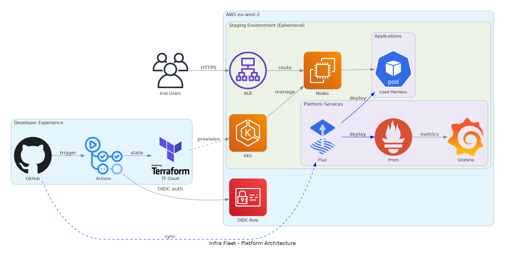

# Infrastructure Fleet

[](https://github.com/your-org/infra-fleet/actions/workflows/load-harness-ci.yml)
[](https://github.com/your-org/infra-fleet/actions/workflows/infra-apply.yml)
[](https://opensource.org/licenses/MIT)
[](https://kubernetes.io/)
[](https://fluxcd.io/)

A production-grade AWS EKS platform demonstrating modern cloud-native practices: GitOps, progressive delivery, comprehensive observability, and cost-optimized operations.

**Live at**: [https://app.example.com](https://app.example.com) (when cluster is running)

---

## Platform Capabilities

| Category | Technologies |
|----------|-------------|
| **Infrastructure** | EKS 1.32, Terraform, Spot Instances |
| **GitOps** | Flux v2.7.3, Image Automation, HelmReleases |
| **Progressive Delivery** | Flagger, Canary Deployments, Automated Rollback |
| **Observability** | Prometheus, Grafana, DORA Metrics Dashboard |
| **Security** | OIDC Authentication, TLS/HTTPS, Trivy Scanning |
| **CI/CD** | GitHub Actions, release-please, Dependabot |

---

## Architecture



**Key Flows:**
- **CI/CD**: Push → GitHub Actions → Build/Test → ECR → Flux Image Automation → Deploy
- **Progressive Delivery**: New version → Flagger canary → Traffic shifting → Metrics analysis → Promote/Rollback
- **Observability**: Applications → Prometheus scrape → Grafana dashboards → DORA metrics

See [docs/README.md](docs/README.md) for detailed architecture diagram.

---

## Key Features

### Progressive Delivery with Flagger

Automated canary deployments with metric-based promotion:

```yaml
# Canary configuration
analysis:
  interval: 30s
  threshold: 5
  maxWeight: 50        # Max 50% traffic to canary
  stepWeight: 10       # 10% increments
  metrics:
    - name: nginx-request-success-rate
      thresholdRange:
        min: 99        # Requires 99% success rate
    - name: nginx-request-duration
      thresholdRange:
        max: 500       # p99 latency < 500ms
```

**What happens on deploy:**
1. New version creates canary pods
2. Traffic gradually shifts: 10% → 20% → 30% → 40% → 50%
3. Prometheus metrics analyzed at each step
4. Success → Promote to primary | Failure → Automatic rollback

### Dashboard UI

Web-based interface for load testing and monitoring:

- **Load Tests**: CPU, Memory, Distributed Cluster tests
- **Live Metrics**: Real-time Prometheus integration
- **Per-Pod Monitoring**: CPU/Memory per pod with HPA visibility
- **Dark Mode**: Full dark theme support

Access at: `https://app.example.com/ui`

### DORA Metrics

Track engineering performance with automated metrics collection:

| Metric | Implementation |
|--------|----------------|
| Deployment Frequency | Workflow + Flux deploy events |
| Lead Time for Changes | Commit → Deploy timestamp diff |
| Change Failure Rate | Workflow failures + Flagger rollbacks |
| MTTR | Failure → Recovery time tracking |

### TLS/HTTPS

Automated certificate management:
- **cert-manager** with Let's Encrypt ClusterIssuer
- **Cloudflare DNS** automatically updated on cluster rebuild
- **nginx-ingress** handles TLS termination

---

## Quick Start

### For Developers

```bash
# Clone and run locally
cd applications/load-harness/local-dev
./dev.sh up-full

# Access the dashboard
open http://localhost:8080/ui

# Run tests
./dev.sh test
```

### For Platform Engineers

```bash
# Start the cluster
gh workflow run rebuild-stack.yml

# Access services
kubectl port-forward -n observability svc/kube-prometheus-stack-grafana 3000:80
kubectl port-forward -n applications svc/load-harness 8080:5000

# Or use HTTPS (when DNS is configured)
open https://app.example.com

# Stop the cluster
gh workflow run nightly-destroy.yml -f reason="End of session"
```

---

## Repository Structure

```
infra-fleet/
├── infrastructure/                 # Terraform IaC
│   ├── permanent/                  # OIDC, ECR (never destroyed)
│   └── staging/                    # EKS cluster (ephemeral)
│
├── applications/
│   └── load-harness/               # Python Flask application
│       ├── src/load_harness/       # Application code
│       │   ├── services/           # JobManager, Prometheus, Metrics providers
│       │   ├── workers/            # CPU/Memory background workers
│       │   ├── middleware/         # Auth, Chaos, Security headers
│       │   ├── dashboard/          # Web UI (routes.py)
│       │   └── templates/          # HTMX + Tailwind templates
│       ├── tests/                  # Test suite (104 tests)
│       ├── monitoring/             # Grafana dashboards (JSON)
│       └── local-dev/              # Docker Compose dev environment
│
├── k8s/                            # GitOps manifests
│   ├── flux-system/                # Flux controllers + kustomizations
│   ├── infrastructure/             # Helm releases, namespaces
│   │   ├── cert-manager/           # TLS certificates
│   │   ├── flagger/                # Progressive delivery
│   │   ├── nginx-ingress-controller/
│   │   └── observability/          # Prometheus, Grafana, Pushgateway
│   └── applications/               # App deployments
│       └── load-harness/           # Deployment, Service, Ingress, Canary, HPA
│
├── policies/                       # Kyverno policies for CI validation
├── ops/                            # Operational scripts
├── docs/                           # Documentation
└── .github/workflows/              # CI/CD pipelines
```

---

## Technology Stack

### Infrastructure
| Component | Version | Purpose |
|-----------|---------|---------|
| EKS | 1.32 | Kubernetes control plane |
| Terraform | 1.12+ | Infrastructure as Code |
| Flux | v2.7.3 | GitOps operator |
| Spot Instances | t3.large | Cost-optimized compute |

### Platform Services
| Component | Purpose |
|-----------|---------|
| nginx-ingress | Ingress controller + canary traffic splitting |
| cert-manager | Automated TLS certificates |
| Flagger | Progressive delivery / canary deployments |
| metrics-server | HPA scaling metrics |

### Observability
| Component | Purpose |
|-----------|---------|
| Prometheus | Metrics collection |
| Grafana | Dashboards and visualization |
| Pushgateway | DORA metrics collection |
| ServiceMonitors | Auto-discovery of scrape targets |

### CI/CD
| Component | Purpose |
|-----------|---------|
| GitHub Actions | Build, test, deploy pipelines |
| release-please | Automated versioning and changelogs |
| Dependabot | Dependency updates |
| Trivy | Container security scanning |
| Kyverno CLI | Policy validation in CI |

---

## Workflows

### On Every Push to Main

```
┌─────────────┐    ┌─────────────┐    ┌─────────────┐    ┌─────────────┐
│   Build &   │ → │   Trivy     │ → │   Push to   │ → │    Flux     │
│    Test     │    │    Scan     │    │     ECR     │    │   Syncs     │
└─────────────┘    └─────────────┘    └─────────────┘    └─────────────┘
                                                                │
                                                                ▼
┌─────────────┐    ┌─────────────┐    ┌─────────────┐    ┌─────────────┐
│   Canary    │ ← │   Flagger   │ ← │   Deploy    │ ← │   Image     │
│  Analysis   │    │   Creates   │    │   Canary    │    │ Automation  │
└─────────────┘    └─────────────┘    └─────────────┘    └─────────────┘
       │
       ▼
┌─────────────────────────────────────────────────────────────────────┐
│  Metrics Check: Success Rate > 99% && p99 Latency < 500ms          │
│  ✅ Pass → Promote to Primary                                       │
│  ❌ Fail → Automatic Rollback                                       │
└─────────────────────────────────────────────────────────────────────┘
```

### Daily Schedule

| Time (UTC) | Workflow | Purpose |
|------------|----------|---------|
| 08:00 | rebuild-stack.yml | Start cluster for work day |
| onWorkflow Triggers | dora-metrics.yml | Collect deployment metrics |
| 20:00 | nightly-destroy.yml | Destroy cluster (cost control) |

---

## Cost Optimization

**Running production-grade Kubernetes for ~$40-50/month**

| Component | Monthly Cost |
|-----------|-------------|
| EKS Control Plane | $26.40 |
| NAT Gateway | $9.90 |
| EC2 Spot (t3.large) | $6.82 |
| **Total** | **~$43/month** |

### Cost Controls
- **Ephemeral staging** - Destroyed nightly at 8 PM UTC
- **Spot instances** - 70% cheaper than on-demand
- **EKS 1.32** - Avoided $138/month extended support fees
- **nginx-ingress** - Free (vs ALB at $17/month)
- **Slim Flux** - Only essential controllers deployed

---

## Documentation

### Getting Started
- [Platform Roadmap](docs/PLATFORM-BUILD-ROADMAP.md) - Vision and completed phases
- [Release Engineering Roadmap](docs/RELEASE-ENGINEERING-ROADMAP.md) - CI/CD maturity
- [EKS Access Guide](docs/EKS-ACCESS.md) - Cluster access methods

### Operations
- [GitOps Setup](docs/GITOPS-SETUP.md) - Flux configuration and CRD ordering
- [Progressive Delivery](docs/PROGRESSIVE-DELIVERY.md) - Flagger canary deployments
- [DORA Metrics](docs/DORA-METRICS.md) - Metrics collection and dashboard
- [TLS/SSL Setup](docs/TLS-SSL-SETUP.md) - Certificate management
- [Stack Automation](docs/STACK-AUTOMATION.md) - Nightly destroy/rebuild

### Development
- [Versioning Strategy](docs/VERSIONING-STRATEGY.md) - SemVer and release-please
- [Commit Messages](docs/COMMIT-MESSAGES.md) - Conventional commits
- [Cost Optimization Guide](docs/COST-OPTIMIZATION-GUIDE.md) - Cost analysis

---

## Project Status

### Completed
- [x] EKS 1.32 + Flux v2.7.3 GitOps
- [x] Prometheus + Grafana observability
- [x] Flagger progressive delivery (canary deployments)
- [x] TLS/HTTPS with cert-manager + Let's Encrypt
- [x] Dashboard UI (Flask + HTMX + Tailwind)
- [x] HPA autoscaling (metrics-server + HPA)
- [x] DORA metrics collection and dashboard
- [x] release-please versioning
- [x] Dependabot dependency automation
- [x] Kyverno policy validation in CI

### In Progress
- [ ] GitOps Grafana dashboard provisioning (Issue #124)
- [ ] IAM least-privilege permissions (Issue #296)

### Planned
- [ ] OIDC/SSO cluster access (Issue #92)
- [ ] Multi-environment architecture (Issue #264)

---

**Maintained by**: Platform Engineering
**Last Updated**: 2026-01-03
**License**: MIT
