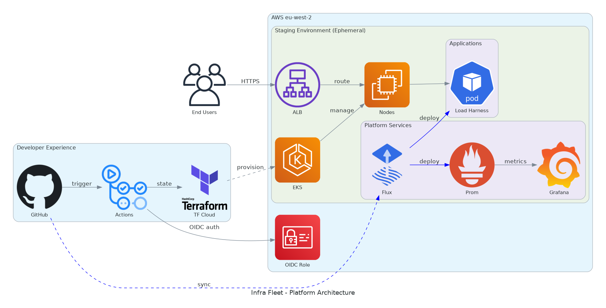

# Infrastructure Fleet

[](LICENSE)
[](https://kubernetes.io/)
[](https://fluxcd.io/)
[](https://github.com/ImranAdan/infra-fleet-public/generate)

**A template for an AWS EKS platform, with a sample application to run on it.**

Copy it, point it at your own AWS account and HCP Terraform organisation, and
you get a GitOps-managed EKS cluster running a Python application with
progressive delivery, observability and DORA metrics — plus the CI/CD to
build, scan, release and deploy it.

The sample application is **the Harness**: a Flask service that generates CPU
and memory load on demand. It exists to give the platform something real to
deploy, scale, canary and measure. Replace it with your own application once
you have seen the machinery work.

---

## This repository cannot deploy anything

It holds **no credentials, no secrets and no account identifiers**, and it is
not named in any IAM trust policy. Its CI validates code — Terraform,
manifests, policies, container images, workflows — and stops there.

That is deliberate, and recorded in
[docs/CREDENTIALS-FREE-TEMPLATE-DDR.md](docs/CREDENTIALS-FREE-TEMPLATE-DDR.md).
A public repository that can reach into a cloud account is a liability; one
that cannot is safe to publish and safe to fork.

So `terraform plan`, `terraform apply`, cluster verification and nightly
destroy **do not run here, and are not expected to**. They run in your private
copy, with your credentials.

**To deploy it: [CONFIGURATION.md](CONFIGURATION.md).**

---

## Try it without an AWS account

The sample application runs locally with no cloud account and no configuration:

```bash
cd applications/load-harness/local-dev
./dev.sh up-full
open http://localhost:8080/ui
```

Worth doing before you decide whether to deploy anything.

---

## What you get

| Category | Technologies |
|----------|-------------|
| **Infrastructure** | EKS 1.32, Terraform, Spot Instances |
| **GitOps** | Flux v2.7.3, Image Automation, HelmReleases |
| **Progressive Delivery** | Flagger, Canary Deployments, Automated Rollback |
| **Observability** | Prometheus, Grafana, DORA Metrics Dashboard |
| **Security** | OIDC Authentication, TLS/HTTPS, Trivy Scanning, Kyverno Policies |
| **CI/CD** | GitHub Actions, release-please, Dependabot |

---
## Architecture



**Key Flows:**
- **CI/CD**: Push → GitHub Actions → Build/Test → ECR → Flux Image Automation → Deploy
- **Progressive Delivery**: New version → Flagger canary → Traffic shifting → Metrics analysis → Promote/Rollback
- **Observability**: Applications → Prometheus scrape → Grafana dashboards → DORA metrics

See [docs/README.md](docs/README.md) for detailed architecture diagram.

---

## Key Features

### Progressive Delivery with Flagger

Automated canary deployments with metric-based promotion:

```yaml
# Canary configuration
analysis:
  interval: 30s
  threshold: 5
  maxWeight: 50        # Max 50% traffic to canary
  stepWeight: 10       # 10% increments
  metrics:
    - name: nginx-request-success-rate
      thresholdRange:
        min: 99        # Requires 99% success rate
    - name: nginx-request-duration
      thresholdRange:
        max: 500       # p99 latency < 500ms
```

**What happens on deploy:**
1. New version creates canary pods
2. Traffic gradually shifts: 10% → 20% → 30% → 40% → 50%
3. Prometheus metrics analyzed at each step
4. Success → Promote to primary | Failure → Automatic rollback

### Dashboard UI

Web-based interface for load testing and monitoring:

- **Load Tests**: CPU, Memory, Distributed Cluster tests
- **Live Metrics**: Real-time Prometheus integration
- **Per-Pod Monitoring**: CPU/Memory per pod with HPA visibility
- **Dark Mode**: Full dark theme support

Access at `https://<your-subdomain>.<your-domain>/ui`, or by port-forwarding
if you are running without a domain.

### DORA Metrics

Track engineering performance with automated metrics collection:

| Metric | Implementation |
|--------|----------------|
| Deployment Frequency | Workflow + Flux deploy events |
| Lead Time for Changes | Commit → Deploy timestamp diff |
| Change Failure Rate | Workflow failures + Flagger rollbacks |
| MTTR | Failure → Recovery time tracking |

### TLS/HTTPS

Automated certificate management:
- **cert-manager** with Let's Encrypt ClusterIssuer
- **Cloudflare DNS** automatically updated on cluster rebuild
- **nginx-ingress** handles TLS termination

---

## Quick Start

### Locally, with no cloud account

```bash
cd applications/load-harness/local-dev
./dev.sh up-full          # app + Prometheus + Grafana in Docker
open http://localhost:8080/ui
./dev.sh test             # run the test suite
```

### On a cluster, in your own copy

These require the credentials set up in [CONFIGURATION.md](CONFIGURATION.md),
and will not work in this repository:

```bash
gh workflow run rebuild-stack.yml       # provision the cluster
kubectl port-forward -n applications svc/load-harness 8080:5000
kubectl port-forward -n observability svc/kube-prometheus-stack-grafana 3000:80
gh workflow run nightly-destroy.yml -f reason="End of session"
```

A custom domain is optional. Without one, port-forwarding reaches everything.

---
## Repository Structure

```
<your-repo>/
├── infrastructure/                 # Terraform IaC
│   ├── permanent/                  # OIDC, ECR (never destroyed)
│   └── staging/                    # EKS cluster (ephemeral)
│
├── applications/
│   └── load-harness/               # Python Flask application
│       ├── src/load_harness/       # Application code
│       │   ├── services/           # JobManager, Prometheus, Metrics providers
│       │   ├── workers/            # CPU/Memory background workers
│       │   ├── middleware/         # Auth, Chaos, Security headers
│       │   ├── dashboard/          # Web UI (routes.py)
│       │   └── templates/          # HTMX + Tailwind templates
│       ├── tests/                  # Test suite (104 tests)
│       ├── monitoring/             # Grafana dashboards (JSON)
│       └── local-dev/              # Docker Compose dev environment
│
├── k8s/                            # GitOps manifests
│   ├── flux-system/                # Flux controllers + kustomizations
│   ├── infrastructure/             # Helm releases, namespaces
│   │   ├── cert-manager/           # TLS certificates
│   │   ├── flagger/                # Progressive delivery
│   │   ├── nginx-ingress-controller/
│   │   └── observability/          # Prometheus, Grafana, Pushgateway
│   └── applications/               # App deployments
│       └── load-harness/           # Deployment, Service, Ingress, Canary, HPA
│
├── policies/                       # Kyverno policies for CI validation
├── ops/                            # Operational scripts
├── docs/                           # Documentation
└── .github/workflows/              # CI/CD pipelines
```

---

## Technology Stack

### Infrastructure
| Component | Version | Purpose |
|-----------|---------|---------|
| EKS | 1.32 | Kubernetes control plane |
| Terraform | 1.12+ | Infrastructure as Code |
| Flux | v2.7.3 | GitOps operator |
| Spot Instances | t3.large | Cost-optimized compute |

### Platform Services
| Component | Purpose |
|-----------|---------|
| nginx-ingress | Ingress controller + canary traffic splitting |
| cert-manager | Automated TLS certificates |
| Flagger | Progressive delivery / canary deployments |
| metrics-server | HPA scaling metrics |

### Observability
| Component | Purpose |
|-----------|---------|
| Prometheus | Metrics collection |
| Grafana | Dashboards and visualization |
| Pushgateway | DORA metrics collection |
| ServiceMonitors | Auto-discovery of scrape targets |

### CI/CD
| Component | Purpose |
|-----------|---------|
| GitHub Actions | Build, test, deploy pipelines |
| release-please | Automated versioning and changelogs |
| Dependabot | Dependency updates |
| Trivy | Container security scanning |
| Kyverno CLI | Policy validation in CI |

---

## Workflows

### On Every Push to Main

```
┌─────────────┐    ┌─────────────┐    ┌─────────────┐    ┌─────────────┐
│   Build &   │ → │   Trivy     │ → │   Push to   │ → │    Flux     │
│    Test     │    │    Scan     │    │     ECR     │    │   Syncs     │
└─────────────┘    └─────────────┘    └─────────────┘    └─────────────┘
                                                                │
                                                                ▼
┌─────────────┐    ┌─────────────┐    ┌─────────────┐    ┌─────────────┐
│   Canary    │ ← │   Flagger   │ ← │   Deploy    │ ← │   Image     │
│  Analysis   │    │   Creates   │    │   Canary    │    │ Automation  │
└─────────────┘    └─────────────┘    └─────────────┘    └─────────────┘
       │
       ▼
┌─────────────────────────────────────────────────────────────────────┐
│  Metrics Check: Success Rate > 99% && p99 Latency < 500ms          │
│  ✅ Pass → Promote to Primary                                       │
│  ❌ Fail → Automatic Rollback                                       │
└─────────────────────────────────────────────────────────────────────┘
```

### Scheduling

Both lifecycle workflows are **manual** (`workflow_dispatch`):

| Workflow | Purpose |
|----------|---------|
| `rebuild-stack.yml` | Provision the cluster |
| `nightly-destroy.yml` | Tear it down, to stop paying for it |
| `dora-metrics.yml` | Runs automatically after deployment workflows complete |

`nightly-destroy.yml` previously ran on a nightly cron. That trigger was
removed — a scheduled `terraform destroy` in a template someone else has
forked is a poor default. Re-enable it in your own copy by restoring the
`schedule:` trigger, and expect to pay for the cluster until you do.

---
## Cost Optimization

Roughly **$40-50/month** for the full stack left running continuously, in
`eu-west-2`. Your figures will differ by region and usage — treat the table as
illustrative, not a quote.

| Component | Monthly Cost |
|-----------|-------------|
| EKS Control Plane | $26.40 |
| NAT Gateway | $9.90 |
| EC2 Spot (t3.large) | $6.82 |
| **Total** | **~$43/month** |

### Cost Controls
- **Ephemeral staging** - destroy it when you are not using it (`nightly-destroy.yml`)
- **Spot instances** - 70% cheaper than on-demand
- **EKS 1.32** - Avoided $138/month extended support fees
- **nginx-ingress** - Free (vs ALB at $17/month)
- **Slim Flux** - Only essential controllers deployed

---

## Documentation

### Adopting this template
- **[CONFIGURATION.md](CONFIGURATION.md)** - every value you need to supply. Start here
- [Credentials-Free Template (DDR)](docs/CREDENTIALS-FREE-TEMPLATE-DDR.md) - why this repository holds no secrets
- [GitHub OIDC Setup](docs/GITHUB-OIDC-SETUP.md) - AWS trust configuration
- [Terraform Cloud Setup](docs/TERRAFORM-CLOUD-SETUP.md) - HCP Terraform workspaces
- [SECURITY.md](SECURITY.md) - security policy and notes for forks
- [CONTRIBUTING.md](CONTRIBUTING.md) - how to contribute to the template

### Operating the platform
- [EKS Access Guide](docs/EKS-ACCESS.md) - reaching the cluster
- [GitOps Setup](docs/GITOPS-SETUP.md) - Flux configuration and CRD ordering
- [Progressive Delivery](docs/PROGRESSIVE-DELIVERY.md) - Flagger canary deployments
- [Canary Deployments](docs/CANARY-DEPLOYMENTS.md) - canary configuration
- [DORA Metrics](docs/DORA-METRICS.md) - metrics collection and dashboard
- [Monitoring Setup](docs/MONITORING-SETUP.md) - Prometheus and Grafana
- [TLS/SSL Setup](docs/TLS-SSL-SETUP.md) - certificate management
- [Stack Automation](docs/STACK-AUTOMATION.md) - destroy and rebuild
- [Cost Optimization](docs/COST-OPTIMIZATION-GUIDE.md) - what it costs and why

### Contributing to this template
- [Versioning Strategy](docs/VERSIONING-STRATEGY.md) - SemVer and release-please
- [Commit Messages](docs/COMMIT-MESSAGES.md) - conventional commits, enforced by CI
- [Dependabot](docs/DEPENDABOT.md) - dependency update policy
- [Local Workflow Testing](docs/ACT-LOCAL-TESTING.md) - running workflows with act

### Design records and project history
These document decisions and plans specific to the original project. They are
kept for the reasoning, not as instructions for adopters.
- [Terraform Cloud / EKS Access (DDR)](docs/TERRAFORM-CLOUD-EKS-DDR.md)
- [Multi-Environment Design](docs/MULTI-ENVIRONMENT-DESIGN.md)
- [Security Concerns](docs/SECURITY-CONCERNS.md) - audit findings and their status

---

## License

MIT — see [LICENSE](LICENSE).

The sample application, infrastructure code and documentation are all covered.
You are free to use this as the basis for your own platform, commercial or
otherwise.
