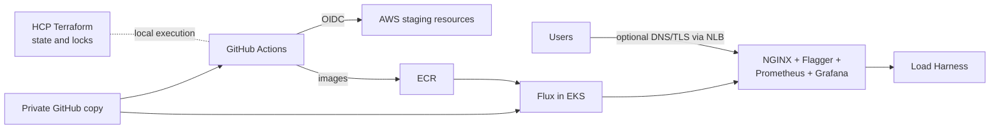

<div align="center">

# Infrastructure Fleet

**An opinionated staging Kubernetes platform you can fork — and a sample app that puts it through its paces.**

EKS · GitOps · canary deployments with automatic rollback · Prometheus and Grafana · DORA metrics · one-command teardown to keep the bill honest

[](LICENSE)
[](https://kubernetes.io/)
[](https://fluxcd.io/)
[](https://developer.hashicorp.com/terraform)
[](docs/CREDENTIALS-FREE-TEMPLATE-DDR.md)
[](https://github.com/ImranAdan/infra-fleet-public/generate)

[Try it locally](#try-it-locally-first) · [What you get](#what-you-get) · [Make it yours](CONFIGURATION.md) · [Docs](docs/README.md)

</div>

---

> **Deployment preview:** the current canary path still depends on the retired
> community `ingress-nginx` controller. Existing artifacts remain available,
> but upstream no longer ships bug or security fixes. Use the local path freely;
> do not expose a new public deployment until the planned Gateway API migration
> has been completed and validated through an apply, rollout, rollback, and
> destroy cycle.

---

## Try it locally, first

No AWS account. No credentials. No configuration.

```bash
git clone https://github.com/ImranAdan/infra-fleet-public.git
cd infra-fleet-public/applications/load-harness/local-dev
./dev.sh up-full
```

First run builds the image, so give it a few minutes; after that it is seconds.

Open **http://localhost:8080/ui** and press a button — the dashboard drives
real CPU and memory load, and you watch Prometheus and Grafana react to it live.

That is the same application the cluster runs, with the same app-level metrics
and dashboards. The cluster adds ingress metrics for canary analysis. If you
like what you see, the rest of this repository is an inspectable staging
implementation—not a production blueprint.

---

## What you get

Fork this and you have a platform that does the following, on day one:

| | |
|---|---|
| **Models staged delivery** | A release or rebuild tests, scans and publishes an image, Flux picks it up, and Flagger evaluates a canary; the current ingress path remains a non-public preview |
| **Exposes useful signals** | Prometheus, Grafana and an explicitly heuristic DORA-signal pipeline for deployment events, lead time and failures |
| **Makes cost visible** | Spot instances, a slim Flux install, nginx ingress, and a manual teardown workflow for when you are not using it |
| **Proves itself in CI** | Terraform validated and scanned, manifests schema-checked, Kyverno policies enforced, images scanned with Trivy, commit messages linted, releases cut by release-please |
| **Starts credentials-free** | This repository contains no deployment credential, and its Terraform takes the adopter's repository identity as an explicit bootstrap input |

---

## Why this one

Most "reference platform" repositories are a diagram and a `terraform apply`
that stopped working eleven months ago. Three things make this different.

**It is testable, not just diagrammed.** CI checks the application, container,
Terraform and Kubernetes manifests without cloud access. A private copy adds
the live AWS and cluster checks. The sample application generates real load so
autoscaling, canary analysis and the dashboards have something useful to
measure.

**It admits that it costs money.** EKS, NAT, load balancing, storage, public
IPv4 and worker capacity are billed independently. The repository ships with
a destroy workflow because the most reliable cost control for a learning
environment is to turn it off when it is not being used.

**The public source cannot reach your account.** The repository you are reading
has no secrets and no cloud access by design — deliberately, and
[written down](docs/CREDENTIALS-FREE-TEMPLATE-DDR.md). Deployment happens in
your own private copy, with your own credentials, after a bootstrap step you run
yourself. Forking it grants nobody anything.

---

## Make it yours

Click **Use this template** at the top of the repository, or:

```bash
gh repo create my-infra-fleet --private --template ImranAdan/infra-fleet-public
```

**Keep it private.** This template holds no secrets; your deployment will.

Then follow **[CONFIGURATION.md](CONFIGURATION.md)** — every value you need to
supply, where each one comes from, and what you can skip. You need an AWS
account and an HCP Terraform organisation; a first cluster build commonly takes
25–40 minutes. A custom domain is optional; without one, port-forwarding reaches
the application and Grafana.

The sample application is meant to be replaced. Doing so requires preserving
the Service, probe, metrics, image-automation, and canary contracts—not only
adding `/health` and `/metrics` endpoints. See
[replacing the Harness](applications/load-harness/docs/APPLICATION-ROADMAP.md#extending-or-replacing-the-harness).

---
## Architecture


```mermaid
flowchart LR
  GitHub[Private GitHub copy] --> CI[GitHub Actions]
  CI -->|OIDC| AWS[AWS staging resources]
  CI -->|images| ECR[ECR]
  HCP[HCP Terraform<br/>state and locks] -. local execution .- CI
  GitHub --> Flux[Flux in EKS]
  ECR --> Flux
  Flux --> Platform[NGINX + Flagger +<br/>Prometheus + Grafana]
  Platform --> App[Load Harness]
  Users[Users] -->|optional DNS/TLS via NLB| Platform
```

HCP Terraform stores state and locks; Terraform execution and AWS calls happen
on the operator's machine or a GitHub-hosted runner.

**Key Flows:**
- **CI/CD**: Release/Rebuild → GitHub Actions → Build/Test/Scan → ECR → Flux → Deploy
- **Progressive Delivery**: New version → Flagger canary → Traffic shifting → Metrics analysis → Promote/Rollback
- **Observability**: Applications → Prometheus scrape → Grafana dashboards → DORA metrics

See [docs/README.md](docs/README.md) for detailed architecture diagram.

---

## Key Features

### Progressive Delivery with Flagger

Automated canary deployments with metric-based promotion:

```yaml
# Canary configuration
analysis:
  interval: 30s
  threshold: 3         # Failed checks tolerated before rollback
  maxWeight: 50        # Max 50% traffic to canary
  stepWeight: 10       # 10% increments
  metrics:
    - name: nginx-request-success-rate
      thresholdRange:
        min: 99        # Requires 99% success rate
    - name: nginx-request-duration
      thresholdRange:
        max: 500       # p99 latency < 500ms
```

**What happens on deploy:**
1. New version creates canary pods
2. Traffic gradually shifts: 10% → 20% → 30% → 40% → 50%
3. Prometheus metrics analyzed at each step
4. Success → Promote to primary | Failure → Automatic rollback

### Dashboard UI

Web-based interface for load testing and monitoring:

- **Load Tests**: CPU, Memory, Distributed Cluster tests
- **Live Metrics**: Real-time Prometheus integration
- **Per-Pod Monitoring**: CPU/Memory per pod with HPA visibility
- **Dark Mode**: Full dark theme support

Access at `https://<your-subdomain>.<your-domain>/ui`, or by port-forwarding
if you are running without a domain.

### DORA Metrics

Expose heuristic engineering-performance signals from workflow and cluster
events. These are useful for a lab dashboard, not a standards-compliant DORA
measurement system:

| Metric | Implementation |
|--------|----------------|
| Deployment Frequency | Workflow + Flux deploy events |
| Lead Time for Changes | Commit → Deploy timestamp diff |
| Change Failure Rate | Workflow failures + Flagger rollbacks |
| MTTR | Failure → Recovery time tracking |

### TLS/HTTPS

Automated certificate management:
- **cert-manager** with Let's Encrypt ClusterIssuer
- **Cloudflare DNS** automatically updated on cluster rebuild
- **nginx-ingress** handles TLS termination

---

## Repository Structure

```
<your-repo>/
├── infrastructure/                 # Terraform IaC
│   ├── permanent/                  # OIDC, ECR (never destroyed)
│   └── staging/                    # EKS cluster (ephemeral)
│
├── applications/
│   └── load-harness/               # Python Flask application
│       ├── src/load_harness/       # Application code
│       │   ├── services/           # JobManager, Prometheus, Metrics providers
│       │   ├── workers/            # CPU/Memory background workers
│       │   ├── middleware/         # Auth, Chaos, Security headers
│       │   ├── dashboard/          # Web UI (routes.py)
│       │   └── templates/          # HTMX + Tailwind templates
│       ├── tests/                  # Deterministic test suite
│       ├── monitoring/             # Grafana dashboards (JSON)
│       └── local-dev/              # Docker Compose dev environment
│
├── k8s/                            # GitOps manifests
│   ├── flux-system/                # Flux controllers + kustomizations
│   ├── infrastructure/             # Helm releases, namespaces
│   │   ├── cert-manager/           # TLS certificates
│   │   ├── flagger/                # Progressive delivery
│   │   ├── nginx-ingress-controller/
│   │   └── observability/          # Prometheus, Grafana, Pushgateway
│   └── applications/               # App deployments
│       └── load-harness/           # Deployment, Service, Ingress, Canary, HPA
│
├── policies/                       # Kyverno policies for CI validation
├── ops/                            # Operational scripts
├── docs/                           # Documentation
└── .github/workflows/              # CI/CD pipelines
```

---

## Technology Stack

### Infrastructure
| Component | Version | Purpose |
|-----------|---------|---------|
| EKS | 1.35 | Kubernetes control plane |
| Terraform | >= 1.14.0, < 2.0.0 | Infrastructure as Code |
| Flux | v2.7.3 | GitOps operator |
| Spot Instances | t3.large | Cost-optimized compute |

### Platform Services
| Component | Purpose |
|-----------|---------|
| nginx-ingress | Ingress controller + canary traffic splitting |
| cert-manager | Automated TLS certificates |
| Flagger | Progressive delivery / canary deployments |
| metrics-server | HPA scaling metrics |

### Observability
| Component | Purpose |
|-----------|---------|
| Prometheus | Metrics collection |
| Grafana | Dashboards and visualization |
| Pushgateway | DORA metrics collection |
| ServiceMonitors | Auto-discovery of scrape targets |

### CI/CD
| Component | Purpose |
|-----------|---------|
| GitHub Actions | Build, test, deploy pipelines |
| release-please | Automated versioning and changelogs |
| Dependabot | Dependency updates |
| Trivy | Container security scanning |
| Kyverno CLI | Policy validation in CI |

---

## Workflows

### On a release or manual rebuild

```
┌─────────────┐    ┌─────────────┐    ┌─────────────┐    ┌─────────────┐
│   Build &   │ → │   Trivy     │ → │   Push to   │ → │    Flux     │
│    Test     │    │    Scan     │    │     ECR     │    │   Syncs     │
└─────────────┘    └─────────────┘    └─────────────┘    └─────────────┘
                                                                │
                                                                ▼
┌─────────────┐    ┌─────────────┐    ┌─────────────┐    ┌─────────────┐
│   Canary    │ ← │   Flagger   │ ← │   Deploy    │ ← │   Image     │
│  Analysis   │    │   Creates   │    │   Canary    │    │ Automation  │
└─────────────┘    └─────────────┘    └─────────────┘    └─────────────┘
       │
       ▼
┌─────────────────────────────────────────────────────────────────────┐
│  Metrics Check: Success Rate > 99% && p99 Latency < 500ms          │
│  ✅ Pass → Promote to Primary                                       │
│  ❌ Fail → Automatic Rollback                                       │
└─────────────────────────────────────────────────────────────────────┘
```

### Scheduling

Both lifecycle workflows are **manual** (`workflow_dispatch`):

| Workflow | Purpose |
|----------|---------|
| `rebuild-stack.yml` | Provision the cluster |
| `nightly-destroy.yml` | Tear it down, to stop paying for it |
| `dora-metrics.yml` | Runs automatically after deployment workflows complete |

`nightly-destroy.yml` previously ran on a nightly cron. That trigger was
removed — a scheduled `terraform destroy` in a template someone else has
forked is a poor default. An adopter who adds a schedule owns its timing,
approval, and failure-notification design.

---
## Cost Optimization

This stack creates billable AWS resources. At the currently published
[AWS EKS price](https://aws.amazon.com/eks/pricing/), a control plane under
standard version support alone is `$0.10` per cluster-hour. NAT
gateway time and data, Spot nodes, load balancing, storage and public IPv4 are
additional and vary by region and use. Check current AWS pricing and set an AWS
Budget before applying the stack.

The manual destroy workflow removes the ephemeral staging resources. It does
not remove the permanent ECR repository or IAM resources, and it is not
scheduled by default.

### Cost Controls
- **Ephemeral staging** - destroy it when you are not using it (`nightly-destroy.yml`)
- **Spot instances** - variable discounts in exchange for interruption risk
- **EKS 1.35 with `STANDARD` support** - prevents accidental extended-support billing
- **Manual teardown** - removes hourly staging resources when the lab is idle
- **Slim Flux** - Only essential controllers deployed

---

## Documentation

### Adopting this template
- **[CONFIGURATION.md](CONFIGURATION.md)** - every value you need to supply. Start here
- [Credentials-Free Template (DDR)](docs/CREDENTIALS-FREE-TEMPLATE-DDR.md) - why this repository holds no secrets
- [GitHub OIDC Setup](docs/GITHUB-OIDC-SETUP.md) - AWS trust configuration
- [Terraform Cloud Setup](docs/TERRAFORM-CLOUD-SETUP.md) - HCP Terraform workspaces
- [SECURITY.md](SECURITY.md) - security policy and notes for forks
- [CONTRIBUTING.md](CONTRIBUTING.md) - how to contribute to the template

### Operating the platform
- [EKS Access Guide](docs/EKS-ACCESS.md) - reaching the cluster
- [GitOps Setup](docs/GITOPS-SETUP.md) - Flux configuration and CRD ordering
- [Progressive Delivery](docs/PROGRESSIVE-DELIVERY.md) - Flagger canary deployments
- [Canary Deployments](docs/CANARY-DEPLOYMENTS.md) - canary configuration
- [DORA Metrics](docs/DORA-METRICS.md) - metrics collection and dashboard
- [Monitoring Setup](docs/MONITORING-SETUP.md) - Prometheus and Grafana
- [TLS/SSL Setup](docs/TLS-SSL-SETUP.md) - certificate management
- [Stack Automation](docs/STACK-AUTOMATION.md) - destroy and rebuild
- [Cost Optimization](docs/COST-OPTIMIZATION-GUIDE.md) - what it costs and why

### Contributing to this template
- [Versioning Strategy](docs/VERSIONING-STRATEGY.md) - SemVer and release-please
- [Commit Messages](docs/COMMIT-MESSAGES.md) - conventional commits, enforced by CI
- [Dependabot](docs/DEPENDABOT.md) - dependency update policy
- [Local Workflow Testing](docs/ACT-LOCAL-TESTING.md) - running workflows with act

### Design records and project history
These document decisions and plans specific to the original project. They are
kept for the reasoning, not as instructions for adopters.
- [Terraform Cloud / EKS Access (DDR)](docs/TERRAFORM-CLOUD-EKS-DDR.md)
- [Multi-Environment Design](docs/MULTI-ENVIRONMENT-DESIGN.md)
- [Security Concerns](docs/SECURITY-CONCERNS.md) - audit findings and their status

---

## License

MIT — see [LICENSE](LICENSE).

The sample application, infrastructure code and documentation are all covered.
You are free to use this as the basis for your own platform, commercial or
otherwise.
