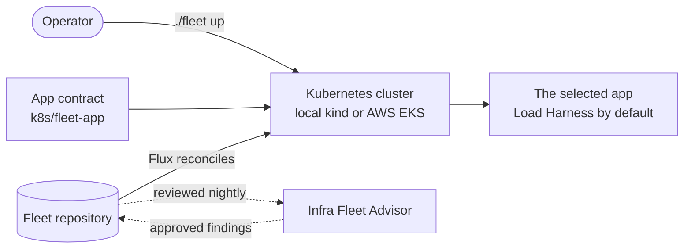

<div align="center">

# Infra Fleet

**A staging Kubernetes platform template, with GitOps delivery, observable workloads, and an intent-driven advisor.**

Local Kubernetes or EKS · Flux GitOps · Kyverno admission policies · canary deployments with automatic rollback · Prometheus and Grafana

[](LICENSE)
[](https://kubernetes.io/)
[](https://fluxcd.io/)
[](https://developer.hashicorp.com/terraform)
[](https://github.com/ImranAdan/infra-fleet-public/generate)

[Try it locally](#try-it-locally-first) · [What you get](#what-you-get) · [Make it yours](CONFIGURATION.md) · [Docs](docs/README.md)

</div>

---

Infra Fleet is the platform template in the Infra Fleet project.
[Infra Fleet Advisor](https://github.com/ImranAdan/infra-fleet-advisor-public)
reviews its Git repository against declared security, reliability, and cost
intent and proposes evidenced recommendations for human review. The platform
works independently; the advisor evaluates versioned repository desired state.
See [connecting the advisor](docs/ADVISOR-INTEGRATION.md).

---

> **AWS deployment preview:** the AWS canary path still depends on the retired
> community `ingress-nginx` controller. Existing artifacts remain available,
> but upstream no longer ships bug or security fixes. Use the local path freely;
> do not expose a new public deployment until the planned Gateway API migration
> has been completed and validated through an apply, rollout, rollback, and
> destroy cycle. Local Kubernetes uses Envoy Gateway and Gateway API.

---

## Try it locally, first

Choose a [deployment profile](docs/DEPLOYMENT-PROFILES.md). Local Kubernetes runs
Flux, Kyverno, Flagger, Envoy Gateway and monitoring on kind, sharing application
resources and delivery controls with AWS staging.

```bash
git clone https://github.com/ImranAdan/infra-fleet-public.git
cd infra-fleet-public
./fleet setup --profile local
./fleet up --profile local
./fleet access --profile local --service app
```

See the guide for prerequisites, login credentials, acceptance checks and
teardown. For faster application-only development, use Docker Compose:

```bash
git clone https://github.com/ImranAdan/infra-fleet-public.git
cd infra-fleet-public/applications/load-harness/local-dev
./dev.sh up-full
```

First run builds the image, so give it a few minutes; after that it is seconds.

Open **http://localhost:8080/ui** and press a button — the dashboard drives
real CPU and memory load, and you watch Prometheus and Grafana react to it live.

That is the same application the cluster runs, with the same app-level metrics
and dashboards. Kubernetes adds GitOps reconciliation, policy enforcement,
network isolation, autoscaling and canary delivery. If you like what you see,
the rest of this repository is an inspectable staging implementation—not a
production blueprint.

---

## What you get

Fork this and you have a platform that does the following, on day one:

| | |
|---|---|
| **Models staged delivery** | Choose local Kubernetes or AWS staging; Flux reconciles the selected profile and Flagger evaluates a canary. AWS routing remains a non-public preview |
| **Runs any app** | The platform names no application: Load Harness is the default, `scripts/select-app.sh podinfo` swaps in another, and CI proves every app can be selected |
| **Exposes useful signals** | Gateway golden signals and a Fleet Application dashboard for whatever runs, provisioned from Git, plus an explicitly heuristic DORA-signal pipeline |
| **Makes cost visible** | Spot instances, a slim Flux install, nginx ingress, and a manual teardown workflow for when you are not using it |
| **Proves itself in CI** | Both profiles rendered and checked, local Flux/Kyverno/canary behaviour exercised, Terraform and images scanned, commits linted |
| **Connects intent to improvement** | Infra Fleet Advisor evaluates declared positions against versioned repository evidence and proposes work for review |

---

## Current verification checkpoint

The local profile has completed a full disposable-cluster acceptance cycle.
Flux repaired deliberate drift, Kyverno rejected unsafe rollout and image
changes, Calico blocked an unauthorized namespace, Prometheus discovered the
application, and Flagger both promoted a healthy revision and rolled back a
forced failure. The same cycle passed with podinfo swapped in for Load Harness,
with no platform change in between. The authenticated application UI and API, Grafana health, and
the Prometheus target were also exercised through operator-facing commands.

Pull-request CI renders and validates both deployment profiles, applies each
profile's admission policies, and tests the application and container. The full
local Kubernetes cycle is a separate `local` GitHub Environment deployment:
run it once against a reviewed candidate revision rather than before and after
every merge. A weekly run against `main`, once with Load Harness and once with
podinfo swapped in, provides continuing integration confidence. AWS staging uses the existing protected `staging` Environment and
still requires an approved account-specific apply, rollout, rollback and destroy
cycle before anyone treats that route as deployment evidence.

Run the final local gate from **Actions → Local Kubernetes → Run workflow** and
select the candidate branch, or use:

```bash
gh workflow run local-kubernetes.yml --ref YOUR_CANDIDATE_BRANCH
```

The workflow records the selected commit as a GitHub deployment, creates the
ephemeral cluster, verifies Flux, Kyverno, networking, monitoring and canary
delivery, and tears the cluster down. See [deployment profiles](docs/DEPLOYMENT-PROFILES.md)
and [GitHub Environments](docs/GITHUB-ENVIRONMENTS.md).

The next review layer is the Advisor. It reads the merged repository revision,
opens a report PR, and waits for a human decision. Merging that report can then
publish eligible recommendations as fleet issues for separately selected fix
PRs. See [connecting the advisor](docs/ADVISOR-INTEGRATION.md) for the exact
handoff.

---

## Why this one

The platform gives you a concrete staging implementation to inspect, adapt,
and evaluate against your own priorities.

**It is testable, not just diagrammed.** CI checks the application, container,
Terraform and Kubernetes manifests without cloud access. A private copy adds
the live AWS and cluster checks. The sample application generates real load so
autoscaling, canary analysis and the dashboards have something useful to
measure.

**It admits that it costs money.** EKS, NAT, load balancing, storage, public
IPv4 and worker capacity are billed independently. The repository ships with
a destroy workflow because the most reliable cost control for a learning
environment is to turn it off when it is not being used.

**Intent guides the next improvement.** The advisor turns declared security,
reliability, and cost positions into deterministic evaluations. Recommendations
cite repository evidence; unsupported positions remain explicit coverage
gaps. You decide which proposals to accept.

---

## Make it yours

Click **Use this template** at the top of the repository, or:

```bash
gh repo create my-infra-fleet --private --template ImranAdan/infra-fleet-public
```

Use a private repository for your deployment configuration and operations.

Start with the [local profile](docs/DEPLOYMENT-PROFILES.md) using Docker, or
follow **[CONFIGURATION.md](CONFIGURATION.md)** for AWS staging. The AWS profile
needs an AWS account and HCP Terraform organisation; a first cluster build
commonly takes 25–40 minutes. A custom domain is optional.

The sample application is meant to be replaced, and the platform names none of
its own: `scripts/select-app.sh podinfo` swaps in a second, unrelated app, and
CI proves every app can be selected. See the
[application contract](docs/APPLICATION-CONTRACT.md).

---
## Architecture


```mermaid
flowchart LR
    Operator([Operator]) -->|"./fleet up"| Cluster
    Repo[("Fleet repository")] -->|Flux reconciles| Cluster["Kubernetes cluster<br/>local kind or AWS EKS"]
    Contract["App contract<br/>k8s/fleet-app"] --> Cluster
    Cluster --> App["The selected app<br/>Load Harness by default"]
    Repo -.->|reviewed nightly| Advisor["Infra Fleet Advisor"]
    Advisor -.->|approved findings| Repo
```

Git is the source of truth: `./fleet` prepares a cluster for the chosen profile,
Flux keeps it matching the repository, and the advisor checks the repository
against declared intent. Each step has its own small diagram in
[docs/ARCHITECTURE.md](docs/ARCHITECTURE.md): profiles, AWS onboarding, GitOps
delivery, progressive delivery, request paths, observability and guardrails.

---

## Key Features

### Progressive Delivery with Flagger

Automated canary deployments with metric-based promotion:

```yaml
# Canary configuration
analysis:
  interval: 30s
  threshold: 3         # Failed checks tolerated before rollback
  maxWeight: 50        # Max 50% traffic to canary
  stepWeight: 10       # 10% increments
  metrics:
    - name: workload-request-success-rate
      thresholdRange:
        min: 99        # Requires 99% success rate
    - name: workload-request-duration
      thresholdRange:
        max: 500       # p99 latency < 500ms
```

**What happens on deploy:**
1. New version creates canary pods; a smoke test and a warm-up run first
2. Traffic gradually shifts: 10% → 20% → 30% → 40% → 50%
3. Success rate and p99 latency are measured at the gateway at each step, so
   any HTTP app can be analysed without exporting its own metrics
4. Success → Promote to primary | Failure → Automatic rollback

### Load Harness dashboard UI

The default app's web interface for load testing and monitoring:

- **Load Tests**: CPU, Memory, Distributed Cluster tests
- **Live Metrics**: Real-time Prometheus integration
- **Per-Pod Monitoring**: CPU/Memory per pod with HPA visibility
- **Dark Mode**: Full dark theme support

Access at `https://<your-subdomain>.<your-domain>/ui`, or by port-forwarding
if you are running without a domain.

### DORA Metrics

Expose heuristic engineering-performance signals from workflow and cluster
events. These are useful for a lab dashboard, not a standards-compliant DORA
measurement system:

| Metric | Implementation |
|--------|----------------|
| Deployment Frequency | Workflow + Flux deploy events |
| Lead Time for Changes | Commit → Deploy timestamp diff |
| Change Failure Rate | Workflow failures + Flagger rollbacks |
| MTTR | Failure → Recovery time tracking |

### TLS/HTTPS

Automated certificate management:
- **cert-manager** with Let's Encrypt ClusterIssuer
- **Cloudflare DNS** automatically updated on cluster rebuild
- **nginx-ingress** handles TLS termination

---

## Repository Structure

```
<your-repo>/
├── infrastructure/                 # Terraform IaC
│   ├── permanent/                  # OIDC, ECR (never destroyed)
│   └── staging/                    # EKS cluster (ephemeral)
│
├── applications/
│   ├── podinfo/                    # Second app: proves the swap
│   └── load-harness/               # Default app: Python Flask load generator
│       ├── src/load_harness/       # Application code
│       │   ├── services/           # JobManager, Prometheus, Metrics providers
│       │   ├── workers/            # CPU/Memory background workers
│       │   ├── middleware/         # Auth, Chaos, Security headers
│       │   ├── dashboard/          # Web UI (routes.py)
│       │   └── templates/          # HTMX + Tailwind templates
│       ├── tests/                  # Deterministic test suite
│       ├── monitoring/             # Grafana dashboards (JSON)
│       └── local-dev/              # Docker Compose dev environment
│
├── k8s/                            # GitOps manifests
│   ├── clusters/                   # Explicit local and AWS Flux roots
│   ├── profiles/                   # Provider-specific composition
│   ├── flux-system/                # Generated Flux controllers + AWS bootstrap
│   ├── infrastructure/             # Shared Helm releases and namespaces
│   │   ├── cert-manager/           # TLS certificates
│   │   ├── flagger/                # Progressive delivery
│   │   ├── nginx-ingress-controller/
│   │   └── observability/          # Prometheus, Grafana, Pushgateway
│   ├── fleet-app/                  # App contract: which app runs, port, paths
│   └── applications/
│       ├── platform/               # Canary, HPA, NetworkPolicy for any app
│       ├── load-harness/           # Default app: Deployment, Service, contract
│       └── podinfo/                # Second app: Deployment, Service, contract
│
├── policies/                       # Kyverno policies for CI validation
├── ops/                            # Operational scripts
├── docs/                           # Documentation
└── .github/workflows/              # CI/CD pipelines
```

---

## Technology Stack

### Infrastructure
| Component | Version | Purpose |
|-----------|---------|---------|
| EKS | 1.35 | Kubernetes control plane |
| Terraform | >= 1.14.0, < 2.0.0 | Infrastructure as Code |
| Flux | v2.7.5 local / v2.7.3 AWS | GitOps operator |
| Spot Instances | t3.large | Cost-optimized compute |

### Platform Services
| Component | Purpose |
|-----------|---------|
| nginx-ingress | Ingress controller + canary traffic splitting |
| cert-manager | Automated TLS certificates |
| Flagger | Progressive delivery / canary deployments |
| metrics-server | HPA scaling metrics |

### Observability
| Component | Purpose |
|-----------|---------|
| Prometheus | Metrics collection |
| Grafana | Dashboards and visualization |
| Pushgateway | DORA metrics collection |
| Envoy / ingress-nginx metrics | App-agnostic request rate, errors and latency |
| PodMonitors / ServiceMonitors | Auto-discovery of scrape targets |

### CI/CD
| Component | Purpose |
|-----------|---------|
| GitHub Actions | Build, test, deploy pipelines |
| release-please | Automated versioning and changelogs |
| Dependabot | Dependency updates |
| Trivy | Container security scanning |
| Kyverno CLI | Policy validation in CI |

---

## Workflows

### On a release or manual rebuild

```
┌─────────────┐    ┌─────────────┐    ┌─────────────┐    ┌─────────────┐
│   Build &   │ → │   Trivy     │ → │   Push to   │ → │    Flux     │
│    Test     │    │    Scan     │    │     ECR     │    │   Syncs     │
└─────────────┘    └─────────────┘    └─────────────┘    └─────────────┘
                                                                │
                                                                ▼
┌─────────────┐    ┌─────────────┐    ┌─────────────┐    ┌─────────────┐
│   Canary    │ ← │   Flagger   │ ← │   Deploy    │ ← │   Image     │
│  Analysis   │    │   Creates   │    │   Canary    │    │ Automation  │
└─────────────┘    └─────────────┘    └─────────────┘    └─────────────┘
       │
       ▼
┌─────────────────────────────────────────────────────────────────────┐
│  Metrics Check: Success Rate > 99% && p99 Latency < 500ms          │
│  ✅ Pass → Promote to Primary                                       │
│  ❌ Fail → Automatic Rollback                                       │
└─────────────────────────────────────────────────────────────────────┘
```

### Deployment gates and scheduling

AWS lifecycle workflows are manual. The local profile has a deliberate manual
deployment gate plus a weekly confidence run:

| Workflow | Purpose |
|----------|---------|
| `local-kubernetes.yml` | Deploys and tests an exact revision in the `local` GitHub Environment, then tears it down; scheduled Mondays at 05:37 UTC |
| `rebuild-stack.yml` | Provision the cluster |
| `nightly-destroy.yml` | Tear it down, to stop paying for it |
| `dora-metrics.yml` | Runs automatically after deployment workflows complete |

`nightly-destroy.yml` previously ran on a nightly cron. That trigger was
removed — a scheduled `terraform destroy` in a template someone else has
forked is a poor default. An adopter who adds a schedule owns its timing,
approval, and failure-notification design.

---
## Cost Optimization

This stack creates billable AWS resources. At the currently published
[AWS EKS price](https://aws.amazon.com/eks/pricing/), a control plane under
standard version support alone is `$0.10` per cluster-hour. NAT
gateway time and data, Spot nodes, load balancing, storage and public IPv4 are
additional and vary by region and use. Check current AWS pricing and set an AWS
Budget before applying the stack.

The manual destroy workflow removes the ephemeral staging resources. It does
not remove the permanent ECR repository or IAM resources, and it is not
scheduled by default.

### Cost Controls
- **Ephemeral staging** - destroy it when you are not using it (`nightly-destroy.yml`)
- **Spot instances** - variable discounts in exchange for interruption risk
- **EKS 1.35 with `STANDARD` support** - prevents accidental extended-support billing
- **Manual teardown** - removes hourly staging resources when the lab is idle
- **Slim Flux** - Only essential controllers deployed

---

## Documentation

### Adopting this template
- **[CONFIGURATION.md](CONFIGURATION.md)** - every value you need to supply. Start here
- [GitHub OIDC Setup](docs/GITHUB-OIDC-SETUP.md) - AWS trust configuration
- [Terraform Cloud Setup](docs/TERRAFORM-CLOUD-SETUP.md) - HCP Terraform workspaces
- [SECURITY.md](SECURITY.md) - security policy and notes for forks
- [CONTRIBUTING.md](CONTRIBUTING.md) - how to contribute to the template

### Operating the platform
- [EKS Access Guide](docs/EKS-ACCESS.md) - reaching the cluster
- [GitOps Setup](docs/GITOPS-SETUP.md) - Flux configuration and CRD ordering
- [Progressive Delivery](docs/PROGRESSIVE-DELIVERY.md) - Flagger canary deployments
- [Canary Deployments](docs/CANARY-DEPLOYMENTS.md) - canary configuration
- [DORA Metrics](docs/DORA-METRICS.md) - metrics collection and dashboard
- [Monitoring Setup](docs/MONITORING-SETUP.md) - Prometheus and Grafana
- [TLS/SSL Setup](docs/TLS-SSL-SETUP.md) - certificate management
- [Stack Automation](docs/STACK-AUTOMATION.md) - destroy and rebuild
- [Cost Optimization](docs/COST-OPTIMIZATION-GUIDE.md) - what it costs and why

### Contributing to this template
- [Versioning Strategy](docs/VERSIONING-STRATEGY.md) - SemVer and release-please
- [Commit Messages](docs/COMMIT-MESSAGES.md) - conventional commits, enforced by CI
- [Dependabot](docs/DEPENDABOT.md) - dependency update policy
- [Local Workflow Testing](docs/ACT-LOCAL-TESTING.md) - running workflows with act

### Design records and project history
These document decisions and plans specific to the original project. They are
kept for the reasoning, not as instructions for adopters.
- [Terraform Cloud / EKS Access (DDR)](docs/TERRAFORM-CLOUD-EKS-DDR.md)
- [Template Deployment Boundaries (DDR)](docs/PUBLIC-TEMPLATE-BOUNDARY-DDR.md)
- [Multi-Environment Design](docs/MULTI-ENVIRONMENT-DESIGN.md)
- [Security Concerns](docs/SECURITY-CONCERNS.md) - audit findings and their status

---

## License

MIT — see [LICENSE](LICENSE).

The sample application, infrastructure code and documentation are all covered.
You are free to use this as the basis for your own platform, commercial or
otherwise.
