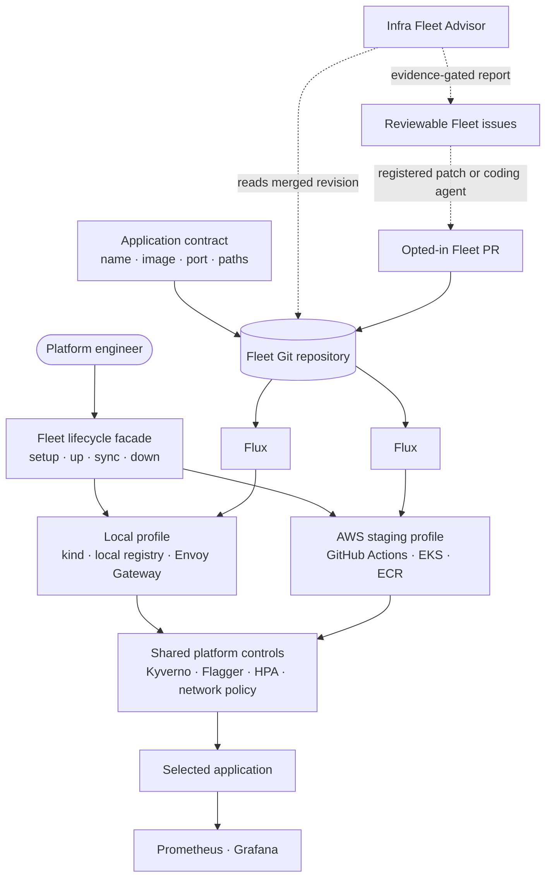

# Infra Fleet

Infra Fleet is a Kubernetes platform template for running one application through a
consistent local or AWS staging lifecycle. It combines Flux GitOps, policy enforcement,
progressive delivery, and observable workloads behind the `./fleet` command.

[Use this template](https://github.com/ImranAdan/infra-fleet-public/generate) ·
[Documentation](docs/README.md) · [Configuration](CONFIGURATION.md) ·
[Contributing](CONTRIBUTING.md) · [Security](SECURITY.md)

> [!IMPORTANT]
> The AWS profile is a staging preview. Both profiles share one Envoy Gateway request
> path that serves the app over HTTPS only; it is live-tested on the local profile but
> has not completed an AWS apply, certificate issue and teardown cycle. Do not expose
> the AWS profile as production infrastructure until it has.

## Scope

The repository provides:

- a common lifecycle for local kind and AWS EKS environments;
- Flux reconciliation from a committed Git revision;
- a swappable application contract, with Load Harness and podinfo as working examples;
- Kyverno admission policies, network isolation, autoscaling, and Flagger canary
  delivery;
- Prometheus metrics and Grafana dashboards provisioned from Git; and
- an integration contract for [Infra Fleet
  Advisor](https://github.com/ImranAdan/infra-fleet-advisor-public).

This is an inspectable staging implementation and an engineering template. Adopters
remain responsible for their production requirements, account controls, availability
targets, and operating model.

## Quick start: local Kubernetes

The local profile runs the platform on kind and does not require an AWS account. It
supports Linux and macOS on amd64 or arm64. Before starting, install Docker, Git, curl,
and OpenSSL, and allocate at least 8 GiB of memory to Docker.

```bash
git clone https://github.com/ImranAdan/infra-fleet-public.git
cd infra-fleet-public

./fleet setup --profile local
./fleet up --profile local
./fleet access --profile local --service app
```

Open <https://localhost:8443/ui/> and accept the self-signed certificate. The `access`
command keeps the port forward open until it is stopped. Use separate terminals for
other services:

```bash
./fleet access --profile local --service prometheus  # http://localhost:9090
./fleet access --profile local --service grafana     # http://localhost:3000
./fleet credentials --profile local                  # application and Grafana credentials
```

The local profile deploys a committed snapshot. After changing the repository, commit
the change and reconcile that revision:

```bash
./fleet sync --profile local
./fleet status --profile local
./fleet test --profile local
```

`test` exercises Flux drift repair, Kyverno admission, network isolation, monitoring,
healthy canary promotion, and forced-failure rollback. Remove the local cluster when
finished:

```bash
./fleet down --profile local
```

`setup`, `up`, and `down` are safe to repeat. Setup installs pinned command-line tools
into checkout-owned state under `.git/fleet`; it does not modify system packages. See
[Local Kubernetes](docs/LOCAL-KUBERNETES.md) and [Deployment
profiles](docs/DEPLOYMENT-PROFILES.md) for the complete operating procedure.

Routine same-repository pull requests opt into exact-head autonomous merge through
the pull-request template. Advisor reports and registered mechanical fixes also
advance without a maintainer click: each generated branch receives explicit
read-only validation, then the existing intent and merge gates decide it. Policy,
credentials, IAM, permanent infrastructure, migrations, releases, and merge
authority still stop for an owner decision. See [Advisor integration](docs/ADVISOR-INTEGRATION.md).

For application-only development, use the Load Harness Docker Compose environment:

```bash
cd applications/load-harness/local-dev
./dev.sh up-full
```

## Deployment profiles

Both profiles use the same application resources and delivery controls. Each profile
owns its provisioning, routing, registry, and environment-specific policy.

| Capability | `local` | `aws-staging` |
|---|---|---|
| Kubernetes | kind on the operator workstation | EKS in the configured AWS account |
| Git source | read-only committed snapshot served locally | configured GitHub repository |
| Registry | loopback development registry | Amazon ECR |
| Request path | Envoy Gateway over HTTPS on loopback (self-signed) | Envoy Gateway over HTTPS behind an AWS NLB (Let's Encrypt) |
| Observability | Prometheus and Grafana with ephemeral storage | Prometheus and Grafana in staging |
| Intended use | development and platform acceptance | account-specific staging evaluation |
| Lifecycle | direct local operations | reviewed GitHub Actions workflows |

The facade exposes the same lifecycle for both targets:

```bash
./fleet setup --profile PROFILE
./fleet up --profile PROFILE
./fleet down --profile PROFILE
```

AWS onboarding requires an AWS account, two HCP Terraform workspaces, GitHub repository
administration access, and account-specific configuration. Start with [Configure a
private fleet](CONFIGURATION.md). `setup --profile aws-staging` validates and plans;
`setup --profile aws-staging --apply` creates the permanent foundation and configures
the target repository.

## Architecture


```mermaid
flowchart TB
    Operator([Platform engineer]) --> CLI["Fleet lifecycle facade<br/>setup · up · sync · down"]
    CLI --> Local["Local profile<br/>kind · local registry · Envoy Gateway"]
    CLI --> AWS["AWS staging profile<br/>GitHub Actions · EKS · ECR"]

    Repo[(Fleet Git repository)] --> FluxLocal[Flux]
    Repo --> FluxAWS[Flux]
    FluxLocal --> Local
    FluxAWS --> AWS

    Contract["Application contract<br/>name · image · port · paths"] --> Repo
    Local --> Platform["Shared platform controls<br/>Kyverno · Flagger · HPA · network policy"]
    AWS --> Platform
    Platform --> App[Selected application]
    App --> Signals["Prometheus · Grafana"]

    Advisor[Infra Fleet Advisor] -. reads merged revision .-> Repo
    Advisor -. evidence-gated report .-> Work[Reviewable Fleet issues]
    Work -. registered patch or coding agent .-> Fix[Opted-in Fleet PR]
    Fix --> Repo
```

Git is the desired-state boundary. Flux reconciles each cluster from the selected
repository revision. The profile determines how the cluster is created and reached; the
shared platform layer determines how the selected application is deployed, constrained,
promoted, and observed.

The advisor is separate from the runtime. It evaluates a merged Fleet revision against
declared intent, opens an exact-head evidence-gated report, and publishes eligible
findings after that report merges. Registered mechanical findings can become Fleet PRs;
every fix still passes Fleet CI, the intent gate, and the merge gate. See [Advisor
integration](docs/ADVISOR-INTEGRATION.md).

The detailed architecture guide separates the profile, onboarding, GitOps, delivery,
request, observability, and guardrail flows: [Architecture](docs/ARCHITECTURE.md).

## Application contract

The platform reads the selected application from `k8s/fleet-app/fleet-app.yaml`.
Platform resources take the application name, image, port, health path, load path,
runtime values, and optional fault switch from that contract.

Load Harness is selected by default. To prove the platform boundary with the second
included application:

```bash
scripts/select-app.sh podinfo
git diff
git add k8s/fleet-app k8s/applications/kustomization.yaml
git commit -m "chore: select podinfo"
./fleet sync --profile local
./fleet test --profile local
```

Each application supplies its source, contract, Deployment, Service, and any
application-specific metrics or dashboards. The platform supplies routing, canary
analysis, autoscaling, network policy, admission policy, and common workload signals.
See [Application contract](docs/APPLICATION-CONTRACT.md) before adding an application.

## Delivery and verification

Verification is divided by cost and evidence level.

| Layer | Trigger | Evidence |
|---|---|---|
| Pull request CI | every pull request | application tests, container build and scan, workflow validation, Terraform static checks, profile rendering, schema checks, policy checks, commit lint, and declared-intent evaluation |
| Local Kubernetes deployment | on demand and weekly against `main` | real Flux reconciliation, admission, isolation, monitoring, canary promotion, rollback, and teardown for every included application |
| AWS staging deployment | manual in a configured private copy | account-specific provisioning, image publication, EKS bootstrap, Flux reconciliation, rollout, and teardown |

Run the full local acceptance workflow against a reviewed candidate branch when a set of
changes is ready for integration:

```bash
gh workflow run local-kubernetes.yml --ref YOUR_CANDIDATE_BRANCH
```

The workflow records the exact tested revision in the `local` GitHub Environment,
creates an ephemeral cluster, runs the acceptance cycle, and tears the cluster down. It
remains separate from ordinary pull request CI because the cluster cycle is
comparatively long. See [GitHub Environments](docs/GITHUB-ENVIRONMENTS.md) for the
deployment evidence model.

Flagger evaluates canary traffic at the gateway. A healthy revision is promoted; a
revision that breaches the configured success-rate or latency thresholds is rolled back.
See [Progressive delivery](docs/PROGRESSIVE-DELIVERY.md) for the analysis sequence and
[Canary deployments](docs/CANARY-DEPLOYMENTS.md) for configuration.

## Repository layout

```text
applications/                  Application source, tests, images, and dashboards
infrastructure/
  permanent/                  AWS OIDC and ECR foundation
  staging/                    Ephemeral EKS staging infrastructure
k8s/
  clusters/                   Flux roots for local and AWS staging
  fleet-app/                  Selected application contract
  applications/               Application manifests and shared platform controls
  infrastructure/             Controllers, observability, and namespaces
  profiles/                   Local and AWS staging composition
policies/                     Shared and profile-specific Kyverno policies
scripts/                      Rendering, validation, selection, and onboarding tools
ops/                          Operational verification scripts
tests/profiles/               Profile and application-contract tests
docs/                         Architecture and operating guides
.github/workflows/             Validation, release, deployment, and teardown automation
```

## Cost optimization

The local profile uses workstation resources. The AWS profile creates billable EKS,
compute, networking, storage, load-balancing, and public IPv4 resources. Review current
AWS pricing and configure an account budget before applying it.

The staging stack is ephemeral and teardown is manual by design:

```bash
./fleet down --profile aws-staging
```

Teardown removes staging resources after an explicit target confirmation. It retains the
permanent OIDC and ECR foundation. Spot worker nodes and a compact controller set reduce
cost, but do not make the AWS profile free. See [Cost
optimization](docs/COST-OPTIMIZATION-GUIDE.md) for the resource model and controls.

## Documentation

| Task | Guide |
|---|---|
| Adopt the template for AWS staging | [Configuration](CONFIGURATION.md) |
| Run and compare deployment targets | [Deployment profiles](docs/DEPLOYMENT-PROFILES.md) |
| Understand system boundaries and flows | [Architecture](docs/ARCHITECTURE.md) |
| Add or select an application | [Application contract](docs/APPLICATION-CONTRACT.md) |
| Operate Flux reconciliation | [GitOps setup](docs/GITOPS-SETUP.md) |
| Inspect metrics and dashboards | [Monitoring](docs/MONITORING-SETUP.md) |
| Review delivery and rollback behavior | [Progressive delivery](docs/PROGRESSIVE-DELIVERY.md) |
| Connect the recommendation workflow | [Advisor integration](docs/ADVISOR-INTEGRATION.md) |
| Understand repository security policy | [Security](SECURITY.md) |
| Prepare a contribution | [Contributing](CONTRIBUTING.md) |

The [documentation index](docs/README.md) contains the complete set of operating guides
and design decision records.

## Contributing

Changes should make the template easier to adopt, safer to operate, or clearer to
verify. Pull requests must use Conventional Commits and include concrete verification
evidence. See [Contributing](CONTRIBUTING.md).

## License

Infra Fleet is available under the [MIT License](LICENSE).
