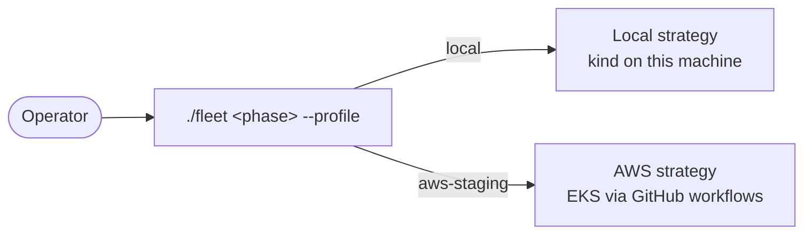
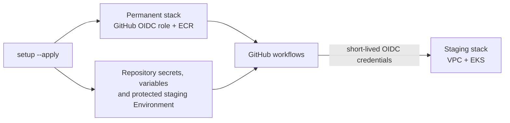
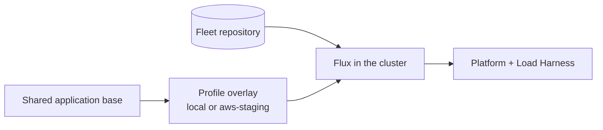
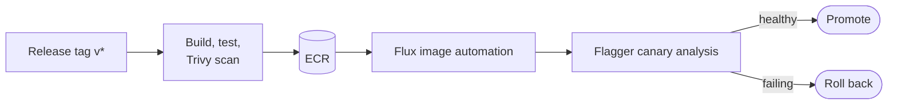
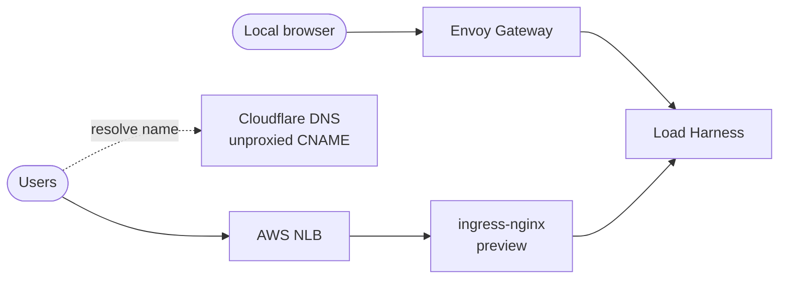
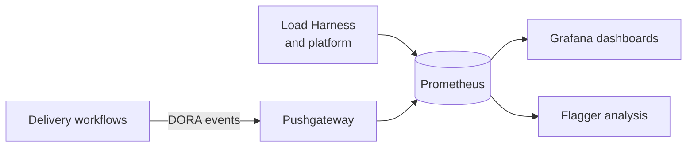
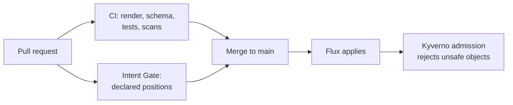

# Architecture

[Documentation index](README.md)

Infra Fleet is easiest to understand one flow at a time. The
[README](../README.md#architecture) shows the whole system in one picture; each
section below zooms into a single step of it and can be read on its own.

| Question | Section |
|---|---|
| How do I pick where the platform runs? | [Profiles](#profiles) |
| How does the AWS profile get credentials and a cluster? | [AWS onboarding](#aws-onboarding) |
| How does a change reach a cluster? | [GitOps delivery](#gitops-delivery) |
| How is a new version released safely? | [Progressive delivery](#progressive-delivery) |
| How does traffic reach the application? | [Request paths](#request-paths) |
| What do I see while it runs? | [Observability](#observability) |
| What stops a bad change? | [Guardrails](#guardrails) |

---

## Profiles

One command surface, two deployment profiles. The facade accepts only the named
profiles and hands the same `setup`, `up` and `down` phases to a fixed strategy.

Local needs no AWS, HCP Terraform or GitHub write access. AWS commands dispatch
reviewed workflows against the repository named in `config.env`. See
[deployment profiles](DEPLOYMENT-PROFILES.md).

## AWS onboarding

`./fleet setup --profile aws-staging` prepares an account once. Plan mode reads
only; `--apply` creates the permanent foundation and configures the repository.

No long-lived AWS keys are stored in GitHub. HCP Terraform holds state and locks;
Terraform runs on the operator's machine or a GitHub-hosted runner. See
[GitHub OIDC](GITHUB-OIDC-SETUP.md) and [environments](GITHUB-ENVIRONMENTS.md).

## GitOps delivery

Git is the source of truth. Flux reconciles each cluster from the repository, and
both profiles build on the same application base with a small profile overlay.

Locally, Flux reads a committed revision from a read-only local Git server, so
uncommitted edits never deploy. On AWS it reads GitHub. Flux repairs drift back to what Git declares.
See [GitOps setup](GITOPS-SETUP.md).

## Progressive delivery

A release tag builds, scans and publishes an image. Flux picks up the new tag and
Flagger shifts traffic to it only while metrics stay healthy.

Critical or High vulnerabilities with a fix block publication. See
[canary deployments](CANARY-DEPLOYMENTS.md) and
[progressive delivery](PROGRESSIVE-DELIVERY.md).

## Request paths

Each profile has its own way in. The AWS route is a non-public preview until the
planned Gateway API migration replaces the retired ingress-nginx controller.

Cloudflare only resolves the name; application traffic goes straight to the NLB.
See [TLS and DNS](TLS-SSL-SETUP.md).

## Observability

The application and platform expose metrics; delivery events add DORA signals.

See [monitoring](MONITORING-SETUP.md) and [DORA metrics](DORA-METRICS.md).

## Guardrails

Three independent checks stand between a bad change and a running cluster.

After merge, [Infra Fleet Advisor](ADVISOR-INTEGRATION.md) reviews the new
revision nightly, proposes a report for human approval and turns approved
findings into issues here.

---

The PNG in this directory is retained as project history; it shows an obsolete
ALB path.
