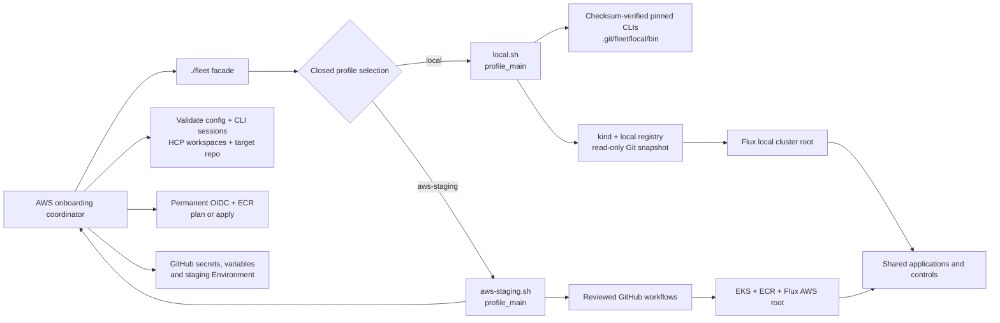

# Deployment profiles

Status: accepted by the maintainer on 2026-09-14.

## Decision

Provide a fixed bootstrap facade (`./fleet`) and declarative `local` and
`aws-staging` profiles. Share Kubernetes application resources, workload
security, rollout capacity controls, monitoring and canary analysis thresholds.
Use Kustomize to compose profiles and Flux to reconcile the selected cluster
root. Profile configuration cannot name an arbitrary executable or provider.

Provisioning remains provider-specific. Local creates kind, Calico, a loopback
registry and a read-only Git snapshot service. AWS invokes the existing
main-branch infrastructure workflows. Selecting AWS remains an explicit action.
The facade does not hide cloud costs or broaden AWS credentials.

The common configuration contract is the `fleet-config` ConfigMap plus existing
runtime Secret names. Application resources consume the selected image through
Kustomize. AWS image automation edits only the AWS profile's image version.
Local builds a committed snapshot and uses a commit-specific image tag; its
Git source has no GitHub token and cannot push to the remote repository.

An AWS configuration adapter translates the existing `terraform-outputs`
ConfigMap into `fleet-config`. This retains compatibility with existing rebuild
workflows while moving the shared platform away from Terraform naming.

Deployment profile, metrics backend, authentication and cookie transport are
separate choices. Local Kubernetes uses the Kubernetes metrics backend and
Gunicorn, preserves authentication, and overrides secure cookies only for
loopback HTTP access. Compose keeps its existing development behaviour.

The local routing implementation is Envoy Gateway/Gateway API. AWS retains its
current staging NGINX preview; moving AWS routing is a separate migration.
Metrics adapters follow the actual traffic provider. Local analysis uses
canary-pod application metrics; AWS analysis uses the existing ingress metrics.

Full profile acceptance is a deployment gate, not a default commit gate. Fast
PR checks validate rendered resources, schemas, policy behavior, application
tests, the container and its image. A maintainer dispatches the full local
cycle once against a reviewed candidate branch; GitHub records that exact
revision in the `local` Environment. The same cycle runs weekly against `main`
to detect integration drift. It does not run automatically both before and
after every merge.

The local deployment is ephemeral and leaves no accessible endpoint after
teardown. AWS jobs continue to use the existing `staging` Environment because
its name is bound into the OIDC trust policy. Renaming that environment requires
a separately reviewed AWS trust migration.

## Strategy boundary

The facade performs closed profile selection and sources one fixed module. Both
modules expose the same `profile_main` interface; configuration cannot provide a
module name or command. This keeps provider selection explicit while allowing
the lifecycle contract to remain uniform.

Local setup installs exact, checksum-verified CLI versions into Git-common
checkout state and later local actions prefer that directory on `PATH`. It does
not mutate system packages or the caller's default Kubernetes context. Teardown
retains the tool cache so a later setup can reuse verified artifacts.

AWS setup treats `config.env` as the non-committed target declaration. Plan mode
is read-only. Apply collects all required deployment values before mutation,
establishes the reversible GitHub Environment boundary before creating AWS
resources, applies the permanent OIDC/ECR stack, and sends required secret
values to the configured repository over standard input. Existing Environment
reviewers and wait timers are preserved; incompatible protection is reported
instead of replaced. Later workflow dispatches name the configured repository
explicitly.

## Consequences

Both profiles must build and pass profile-specific policies in CI. Kyverno
controllers and the selected policies become runtime resources. Local acceptance
must verify drift correction, admission rejection, network isolation, genuine
canary promotion and rollback. Load traffic must hit an endpoint affected by
fault injection; probe-only traffic cannot prove automatic rollback.

No facade action changes the caller's default kubeconfig or contacts AWS when
the local profile is selected. Local teardown is limited to resources bearing
this workspace's ownership record. Local state lives under `.git/fleet/local`
and is shared by linked worktrees. The fixed strategy modules and their common
entry point are part of the public lifecycle contract; a new profile requires a
reviewed facade branch, strategy module, documentation, and profile-specific
validation.

Local acceptance cannot validate AWS IAM, EKS access, cloud load balancing,
physical-node failure or cloud cost. The advisor remains a static repository
review: it must not present local acceptance results as its own live findings.
Its current collector reads manifest files, not effective Kustomize/Helm output;
that limitation must accompany reviews of this layout until rendering support
is implemented and independently validated.
