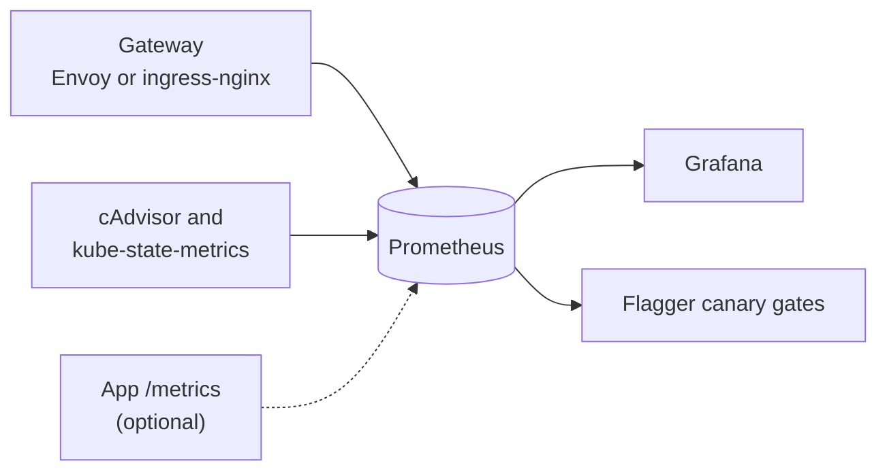

# Monitoring Setup Guide

[Documentation index](README.md)

The observability stack is shared by the local and AWS staging profiles and
describes whichever application the fleet runs (see the
[application contract](APPLICATION-CONTRACT.md)).

## Overview

**kube-prometheus-stack** (chart 67.4.0) provides Prometheus, Grafana,
kube-state-metrics and node-exporter. On top of it the platform adds:

| Signal | Source | Needs anything from the app? |
|---|---|---|
| Request rate, errors, latency | The gateway: Envoy locally (`envoy-proxy` PodMonitor), ingress-nginx on AWS | No |
| CPU, memory, restarts, pods, replicas | cAdvisor and kube-state-metrics | No |
| App-level metrics | The app's own `PodMonitor`, if it ships one | Optional |
| Delivery (DORA) | Pushgateway, fed by the delivery workflows on AWS | No |

The golden signals come from the gateway rather than the app, so Flagger's
canary gates and the platform dashboard work for any HTTP service.



## Access

```bash
./fleet access --profile local --service grafana     # http://localhost:3000
./fleet access --profile local --service prometheus  # http://localhost:9090
./fleet credentials --profile local                 # Grafana user is admin
```

Locally, the bootstrap generates the Grafana password and keeps it across
restarts. On AWS, the rebuild workflow writes the `GRAFANA_ADMIN_PASSWORD`
Actions secret to the runtime-only `grafana-admin-credentials` Secret. No
password is committed.

## Dashboards are provisioned from Git

Grafana has no persistent storage, so nothing is imported by hand. Its
dashboard sidecar loads every ConfigMap labelled `grafana_dashboard: "1"`, and
each dashboard is such a ConfigMap, generated from JSON in Git:

| Dashboard | Lives in | Shows |
|---|---|---|
| **Fleet Application** | `k8s/infrastructure/observability/dashboards/` | Gateway golden signals, CPU and memory by pod against limits, pods, HPA replicas, restarts, and a **Declared intent** row: positions declared, decided, satisfied and divergent in the advisor's latest approved report, the fleet commit it reviewed, and the divergent positions. Names no app. |
| Load Testing Overview, Load Harness | `applications/load-harness/monitoring/` | Load Harness's own view, including its Flask metrics |
| DORA Metrics | `applications/load-harness/monitoring/` | Deployments, lead time and rollbacks (AWS only; nothing pushes them locally) |

An app's dashboards travel with its manifests, so swapping the app swaps them.
To change a dashboard, edit its JSON and commit: edits made in the Grafana UI
do not survive a restart. Platform dashboards sit in a layer Flux substitutes,
so their JSON must not contain `${...}`.

## Configuration

| Component | Setting |
|---|---|
| Prometheus | 2 days retention, 1 GB cap, 15 s scrape, 100m/256Mi requests, 500m/512Mi limits |
| Grafana | No persistence, 50m/128Mi requests, 200m/256Mi limits |
| Discovery | Every `PodMonitor` and `ServiceMonitor` in every namespace |
| Advisor data source | Infinity plugin 3.7.1 (pinned; the newest supporting Grafana 11.4), allowed to call only `https://raw.githubusercontent.com` |
| Disabled | Alertmanager (nothing pages on an ephemeral stack), operator admission webhooks (known timeouts) |

## Declared intent next to live signals

The **Declared intent** row reads `reports/report.json` from the advisor's
`main` branch. That file changes only when a human merges a report PR, so the
row shows the approved decision record, not a draft. It counts positions by
result, names the reviewed fleet commit and the report's age, and lists what
diverges. It describes desired state in Git; the panels above it describe the
running cluster. Grafana needs outbound HTTPS to GitHub for this row; the rest
of the dashboard does not. The template validator exempts this one URL from its
pinned-fetch rule, because it reads data and following `main` is the point.

## Useful queries

| Question | Query |
|---|---|
| Requests per second (local) | `sum(rate(envoy_cluster_upstream_rq{envoy_cluster_name=~"httproute/applications/.*"}[1m]))` |
| 5xx rate (local) | `sum(rate(envoy_cluster_upstream_rq{envoy_cluster_name=~"httproute/applications/.*",envoy_response_code=~"5.."}[5m]))` |
| p99 latency, ms (local) | `histogram_quantile(0.99, sum(rate(envoy_cluster_upstream_rq_time_bucket{envoy_cluster_name=~"httproute/applications/.*"}[5m])) by (le))` |
| Requests per second (AWS) | `sum(rate(nginx_ingress_controller_requests{exported_namespace="applications"}[1m]))` |
| CPU by pod, as % of limit | `sum by (pod) (rate(container_cpu_usage_seconds_total{namespace="applications",container!=""}[1m])) / sum by (pod) (kube_pod_container_resource_limits{namespace="applications",resource="cpu"}) * 100` |

Envoy Gateway keeps a route's primary and canary backends in one Envoy cluster,
so the gateway signals are route-wide rather than per revision.

## Troubleshooting

**A panel shows no data.** Run its query in Prometheus. Gateway panels need
traffic through the gateway; AWS-only series (ingress-nginx, DORA) are
expected to be empty locally.

**An app's own metrics are missing.** Check that its `PodMonitor` exists and
selects both `<app>` and `<app>-primary` pods, since Flagger renames the primary's
`app` label. Then open `http://localhost:9090/targets`.

**Gateway metrics are missing.** Check
`kubectl get podmonitor envoy-proxy -n envoy-gateway-system` and that
`up{namespace="envoy-gateway-system"}` is 1.

**Prometheus runs out of memory.** Lower `retention` or `retentionSize`, or
drop high-cardinality series with relabelling.

## Related documentation

- [Application contract](APPLICATION-CONTRACT.md)
- [Progressive delivery](PROGRESSIVE-DELIVERY.md)
- [Load Harness monitoring guide](../applications/load-harness/monitoring/README.md)
- [DORA metrics](DORA-METRICS.md)
