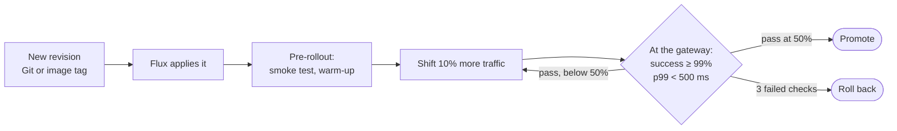

# Progressive Delivery with Flagger

[Documentation index](README.md)

> **Deployment preview:** the local profile uses Envoy Gateway. AWS staging
> retains retired community `ingress-nginx`, which no longer receives security
> fixes, so that route is a private preview. See [../SECURITY.md](../SECURITY.md).

Every new revision of the application reaches users gradually. Flagger shifts
traffic to it in steps, measures it at the gateway, and promotes or rolls it
back without a human. The canary is part of the platform, not the app: it is
written once for whichever app [`k8s/fleet-app`](APPLICATION-CONTRACT.md) names.

## Flow



## The canary

[`k8s/applications/platform/canary.yaml`](../k8s/applications/platform/canary.yaml)
targets the Deployment and HPA named `${APP_NAME}`, which Flux substitutes from
the app contract.

| Setting | Value |
|---|---|
| Interval | 30 s between checks |
| Steps | 10% at a time, up to 50% |
| Threshold | 3 failed checks roll back |
| Gates | `workload-request-success-rate` ≥ 99%, `workload-request-duration` p99 < 500 ms, both over 1 minute |

Webhooks, all run by `flagger-loadtester`:

| Hook | When | What |
|---|---|---|
| `smoke-test` | Before any traffic shifts | `APP_HEALTH_PATH` on the canary Service directly |
| `warm-up` | Before the first check | 30 s of `APP_LOAD_PATH` through the gateway, so the first 1-minute window has data |
| `load-test` | Every step | 10 s at 10 req/s of `APP_LOAD_PATH` through the gateway |

Gateway requests use `hey -host ${APP_HOSTNAME}`. hey is a Go client and
ignores `-H 'Host: …'`, so a Host header set that way never reaches the app's
route: every request gets a 404 from the gateway itself.

## Gates are measured at the gateway

The app needs no metrics of its own. Each profile ships its MetricTemplates
under `k8s/profiles/<profile>/applications/`:

| Profile | Source | Notes |
|---|---|---|
| local | Envoy `envoy_cluster_upstream_rq*` for `httproute/<namespace>/<canary>/rule/*` | Envoy Gateway keeps primary and canary endpoints in one cluster per route rule, so the gates are route-wide. A failing canary still breaks them as its share of traffic rises. |
| aws-staging | ingress-nginx `nginx_ingress_controller_*` for the app's Ingress | prometheus-operator relabels the app's namespace to `exported_namespace`. |

## Try it

```bash
./fleet test --profile local
```

This proves a Git-delivered revision is **promoted**. It also proves a revision
with the app's declared fault switch (`APP_FAULT_ENV`, for example
`FAIL_RATE=1.0` for Load Harness) is **rolled back** while the primary keeps
serving. Both changes are strategic-merge patches on a local-only snapshot:
nothing is committed to your branch, and the app's own files are never edited.

To watch a release:

```bash
kubectl get canary -n applications -w
kubectl describe canary -n applications     # events: Advance, Halt, Promotion
```

| Phase | Meaning |
|---|---|
| `Initialized` | Primary created, waiting for a new revision |
| `Progressing` | Shifting traffic and checking gates |
| `Promoting` / `Finalising` | Gates passed; the canary becomes primary |
| `Succeeded` | Promoted |
| `Failed` | Rolled back to the previous primary |

## Troubleshooting

**`no values found for custom metric`.** No request reached the route in the
last minute. Check that the load test reaches the app:
`kubectl exec -n flux-system deploy/flagger-loadtester -- hey -n 20 -host localhost http://<gateway-service>.envoy-gateway-system/`
should return 200s, not 404s.

**A healthy revision fails the latency gate.** Compare gateway p99 with the
app's own timings from inside a pod. On a one-node lab, check the node first
(`kubectl top node`, `kubectl top pods -A --sort-by=cpu`): a busy node adds
latency to every request. A container at its CPU limit is throttled too; see
`container_cpu_cfs_throttled_periods_total`.

**A sync leaves pods in `ImagePullBackOff`.** The revision, the app contract
and `fleet-config` (the image tag) must change together. `./fleet sync` holds
the applications layer until all three agree, and the first Flux layer of each
profile depends on the root that applies `k8s/fleet-app`. If a sync was
interrupted, run it again; `./fleet up` also clears a leftover hold.

## Reference

- [Flagger documentation](https://docs.flagger.app/)
- [Application contract](APPLICATION-CONTRACT.md)
- [Monitoring setup](MONITORING-SETUP.md)
- [Canary deployments](CANARY-DEPLOYMENTS.md)
